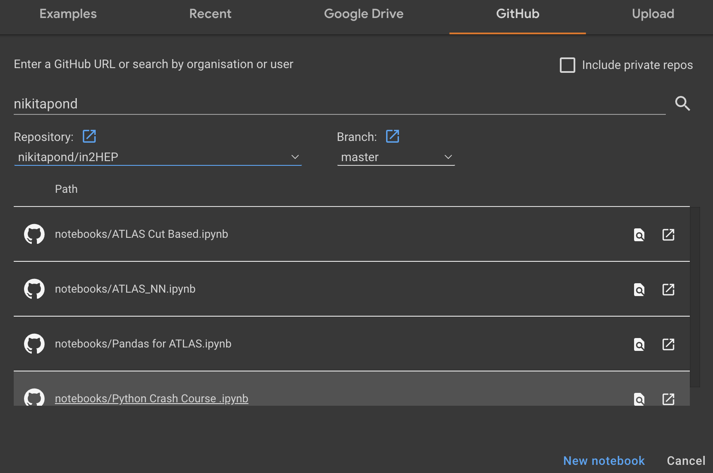

# in2HEP

The repository can be downloaded as a zip [here](https://github.com/ishank95/in2HEP/archive/master.zip). To get up and running:
1. Download the repoistory as a .zip.
2. Unzip the folder.
3. In `start`, load `Anaconda Prompt`.
4. Navigate to the unzipped folder.
5. Type `jupyter notebook`.
6. The exercises are stored inside the `notebooks` folder.

Intro slides can be found [here](http://svanstro.web.cern.ch/svanstro/in2hep/in2hep-outline.pdf).


For the final NN based exercise, you can use a Google [Colab notebook]. To do this, you go to google colab, and open a notebook. Select 'github'. Under the username, type 'nikitapond', select the repository 'in2Hep/master'. You can then open either the ATLAS_NN notebook or the ATLAS Cut Based. (See image below)




## If you are stuck...

Here are some handy links.
* [Python](https://docs.python.org/3/)
* [Jupyter](https://realpython.com/jupyter-notebook-introduction/)
* [Keras](https://keras.io/)

## Running Locally 
You will need:
- Python 3
- numpy
- pandas
- jupyter
- matplotlib
- tensorflow
- keras
- scikit-learn

To install these using conda (ensure conda is installed already):
```bash
conda create -n phas0056
conda activate phas0056
conda install tensorflow numpy pandas matplotlib keras scikit-learn
```

We recommend using google colab. It requires no set up, and gives access to powerful GPUs for training.
